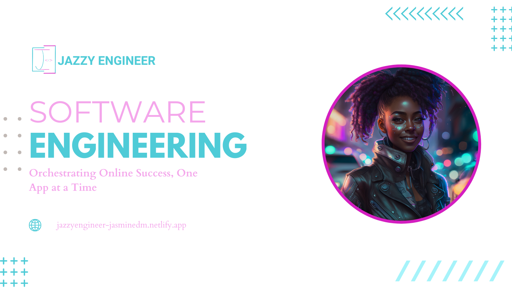

  
  
  
  

 Methodical Software Engineer at Resilient Coders | Full stack web development | Converting client ideas into technical plans.

<section align="center">

</section>

<h1 align="center" style="color:#2da9ad">Technologies</h1>

    
    

    
    
    
    
    

<h1 align="center" style="color:#2da9ad">Let's Connect ʕ•́ᴥ•̀ʔっ</h1>

  
  
  
  

